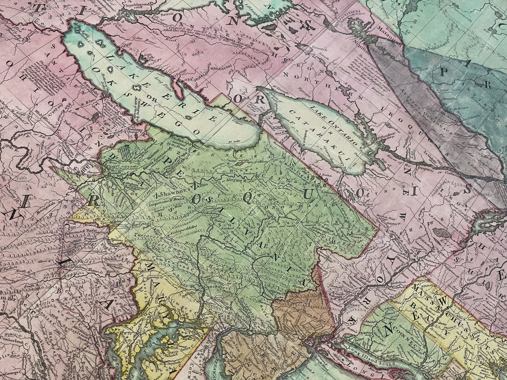

## The motivation for *Movement and Common Worlds: Homelands, Pathways and the Peoples of the Northeast*

This project seeks to address a problem with how maps have handled the presence of Native nations in the Northeast. The assumption is that colonies established by the Engish formed a frontier that moved from east to west, sweeping away Native nations and peoples as it went. Recent history has moved away from a story of colonialism and toward one in which an Indigenous Continent ‘slowly became colonial’. Maps are an effective way to see that story.

To do that we need to look at maps produced by British surveyors in a different way. On one view, they show the development of colonies marked by names and framed by borders. But as they sought to visualise a colonial world, map makers also depicted a Native world of villages, towns, nations, and confederacies, sitting alongside colonial towns. If you look closely, you will see that each map-based depiction of a ‘colonial world’ is also a depiction of an Indigenous one. In this project, we sought to bring these worlds back together after two centuries of separation and misunderstanding.

## How the kinetic map was made
We wanted to be able to show not only the layers of information that were presented in maps of North America over time, but also how  historic maps consistently revealed the juxtaposition of Native and colonial presence. Since no database existed for this, our first task was to build one. To do this we selected a range of historic maps that, to us, provided the best respresentations of common worlds; these were geo-rectified over a base map and then data points from each map were selected and recorded. These data points included settlements and placenames, both Indigenous and European, as well as rivers and land pathways. A consistent feature of these early maps is that Indigenous homelands are represented by printed words and phrases but their physical extent, unlike that of colonies, are not demarcated by boundary lines. This is starkly illustrated in the image below (an excerpt from John Mitchell's iconic map of 1755). Numerous words and phrases indicate areas associated with particular peoples and Native Nations, and the map's largest label - which arcs across the centre of the map, is 'The Six Nations, or Iroquois'. In the absence of printed boundaries we captured the mapmakers' understandings of the relative locations of Native nations and peoples by recording the position and extent of the associated text segments on the map. It is important to realise, then, that when our map displays a polygon with the associated text "Senekas" this polygon is not delimiting a geographical area but rather the position and alignment of a printed word on the map.

{class="map_page_image"}

## Using the kinetic map
There are two ways to interact with the *Movement and Common Worlds* map application. The first is through the Stories. Start at the 'Overview' and simply scroll downwards slowly. The map display changes to complement the accompanying text and images - see **Stories guide** below for display details. The second mode allows you to explore freely, using a set of filters to see information captured from specific maps. 

## The Project Team

This project is part of 'Brightening the Covenant Chain: Revealing Cultures of Diplomacy between the Crown and the Iroquois Confederacy'. Arts and Humanities Research Council of the United Kingdom, Standard Research Grant AH/T006099/1, Principal Investigator: Professor Joy Porter. Project Team: Charles Prior (project lead, author of map stories); Dr Matthias Wong (PDRA - data mining); Jenson Morse (Project Intern); King’s Digital Lab (Paul Caton, Neil Jakeman, Elliot Hall, Tiffany Ong, Lucie Hao); Project review held at RAI with input from panel: Max Edelson, Chad Anderson, Hayden Haynes (Seneca Nation), Saliha Belmessous, Cassie Wise, Miriam Davis Rosenbaum (National Indian Education Association).

## Stories guide

OVERVIEW  

0.0 **Display**: Blank map - no features displayed. **Text**: "Overview" then "For a long time, American history was ...".  

0.1 **Display**: Blank map - no features displayed. **Text**: "'We live encompassed with people...'".

1 - INTRODUCTION

1.1 **Display**: Indigenous & European settlements and placenames [Mitchell 1755]. **Title**: "Introduction".

1.2 **Display**: (unchanged). **Text**: “Maps of early America do not tell the whole truth ...”

1.3 **Display**: European settlements [Mitchell 1755]. **Text**: “Settlement was fragmented and confined to a narrow strip ...”.
 
1.4 **Display**: Pathways, Indigenous & European settlements [Mitchell 1755]. **Text**: “While the common worlds of ...”.

 2 - HOMELANDS

2.0 **Display**: Selection of Indigenous-related annotations [Mitchell 1755], transforming from normalized spelling to Indigenous versions. **Title**: "Homelands".

2.1 **Display**: Rivers, Indigenous & European settlements [Mitchell 1755]. **Text**: “American history begins with the deep history of the land ...”
 
2.2 **Display**: Rivers [Mitchell 1755]; Indigenous settlements and placenames [all maps]. **Text**: “The Indigenous landscape was more than a homeland ...”.
 
2.3 **Display**: Principal rivers, Indigenous settlements, placenames and council fires [all maps]. **Text**: “The land was political ...”. 

2.4 **Display**: Charlestown [Mitchell 1755]; Catawba territory (source: https://native-land.ca/maps/territories/catawba/). **Text**: “Indigenous people were map makers ...”. 

2.5 **Display**: Haudenosaunee-related annotations [Mitchell 1755]. **Text**: “Haudenosaunee can be translated as ‘the whole house’ ...”. 

2.6 **Display**: Haudenosaunee-related annotation "Iroquois" and colonial domains Virginia, Pennsylvania, New York [Mitchell 1755]. **Text**: “British mapmakers took care in noting ...”. 

2.7 **Display**: as above + other Indigenous-related annotations [Mitchell 1755]. **Text**: “Yet this was not a wholly peaceful landscape ...”. 

2.8 **Display**: Indigenous settlements, principal rivers [all maps]. **Text**: “The United Colonies emerged as a new power ...”.

2.9 **Display**: Indigenous & European settlements, council fires [all maps]; Haudenosaunee-related annotations [Cary 1783, Bradley 1796]. **Text**: “The village worlds of the Haudenosaunee were broken apart ...”. 

 
3 - PATHWAYS

3.0 **Display**: Two animations - principal rivers followed by pathway & council fires  [Mitchell 1755]. **Title**: "Pathways".

3.1 **Display**: Pathways, Indigenous & European settlements [Mitchell 1755]. **Text**: “For the Haudenosaunee, the path was a powerful metaphor ...”.

3.2 **Display**:  Pathways, principal rivers [all maps]; Indigenous & European settlements [Mitchell 1755]. **Text**:“Pathways were conduits of communication ...”. 

3.3 **Display**: Pathways, Indigenous & European settlements [Mitchell 1755]. **Text**: “For the geographer Lewis Evans ...”.

3.4 **Display**: Rivers [Bradley 1796]; Indigenous & European settlements [Mitchell 1755]. **Text**: “Washington found himself serving as a messenger ...”.

3.5 **Display**: Rivers [Bradley 1796]. **Text**: “As Washington learned, rivers were the highways ...”.

3.6 **Display**: Rivers, pathways [Bradley 1796]. **Text**: “Europeans found their way along single file ...”.

4 - VILLAGERS, SETTLERS

4.0 **Display**: Animation of council fire sites [Mitchell 1755]. **Title**: "Villagers, Settlers".

4.1 **Display**: Indigenous settlements and placenames [Foster 1677]. **Text**: “European claims to the conquest of the ‘new world’ ...”.

4.2 **Display**: Indigenous settlements [White 1590]. **Text**: “The English settled among Indigenous nations ...”.

4.3 **Display**: Hudson River, Indigenous & European settlements [Foster 1677]. **Text**: “A century after the creation of White’s map ...". 

4.4 **Display**: Principal rivers, Haudenosaunee settlements [all maps]. **Text**: “The creation of new colonies disrupted the flows ...” 

4.5 **Display**: Principal rivers, Indigenous & European settlements [Evans 1752]. **Text**: “Settlers pushed out of towns and villages  ...”. 

4.6 **Display**: Border lines [Mitchell 1755]. **Text**: “As British traders, diplomats and settlers ...”. 

4.7 **Display**: Border lines [Buell 1784]. **Text**: “Increasingly, maps portrayed colonies as ...”. 

4.8 **Display**: Mississippi River system, Indigenous settlements [Mitchell 1755, Hutchins 1778]. **Text**: “Jefferies map is concerned with larger spaces ...”. 

4.9 **Display**: Pathways, Indigenous & European settlements, council fires [Bradley 1796]. **Text**: “Abraham Bradley’s *A Map of the United State*s* shows ...”. 
 

5 - LINES 

5.0 **Display**: Four animations of expanding border lines [Seller 1676; Burghers 1738; Mitchell 1755; Bradley 1796]. **Title**: "Lines".

5.1 **Display**: Virginia [Mitchell 1755]. **Text**: “The royal charters that created colonies out of ...”. 

5.2 **Display**: Colonial domains [Burghers 1738]. **Text**: “As settlement expanded into the western reaches ...”. 

5.3 **Display**: Pathways, descriptions, European settlements [Evans 1752]. **Text**: “The most detailed maps focused on areas ...”. 

5.4 **Display**: Indigenous settlements, colonial domains [Mitchell 1755]. **Text**: “William Herbert’s ‘new’ and ‘accurate’ map ...”. 

5.5 **Display**: European, Indigenous and Haudenosaunee-related annotations [Mitchell 1755]. **Text**: “The charter borders of colonies are shown at scale ...”. 

5.6 **Display**: Colonial domains [Burghers 1738] with 1763 Royal Proclamation line added. **Text**: “The Royal Proclamation of 1763 created ...”. 

5.7 **Display**: (unchanged). **Text**: “A letter in the St. James’ Chronicle ...”. 

5.8 **Display**: Colonial border lines [all maps]. **Text**: “Later maps used European treaties to produce ...". 

5.9 **Display**: Colonial border lines [Buell 1784]. **Text**: “Where colonies sat near Indigenous nations ...”.

5.10 **Display**: Connecticut [Buell 1784]. **Text**: “The transition between British Empire and American territorial republic ...”.
 
5.11 **Display**: Colonial border lines [Bradley 1796], Indigenous settlements [Mitchell 1755]. **Text**: “The names and location of Indigenous nations ...”.
 

 

 

 

 

