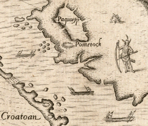

::: slide 5
American history is Indigenous history. It begins with the deep history of the land and its peoples as they existed long
before the arrival of Europeans. The first parties of English – most of them professional soldiers – made coastal
landings and probed the dozens of rivers that led inland. They claimed possession of these spaces according to legal
arguments that gave ownership of empty land to whomever discovered and occupied it. But they soon discovered that the
land was not empty. The Indigenous name of the place they called ‘Virginia’ is Tsenacommacah: the densely inhabited
land.

:::

::: slide 6
The Indigenous landscape was more than a homeland: it was a site of creation. For the coastal Algonquian it was the
Dawnland, for the Haudenosaunee it was Turtle Island – the place where everything had its beginning and its being. The
land was a cultural and moral space, infused with fundamental beliefs, and overlayered with stories that were enacted,
remembered, and shared among kin and with Europeans. The land was political. Haudenosaunee oral tradition drew the land
and its history together in the story of the formation of the Great League of Peace, and where Deganawidah taught
Hiawatha the rituals of the condolence ceremony. As the Onondaga diplomat Canasatego declared at a treaty council in
1744, ‘our Ancestors came out of this very Ground, and their Children have remained here ever since’.
:::

::: slide 7
Indigenous peoples were map-makers, but these maps were carried in the mind and then sketched with charcoal on hide or
bark, or drawn with a stick on soft soil; at other times they were gestural, using the hand as an approximation of a
region and its key points of settlement. Europeans copied these maps, which allow us to glimpse the ways in which
Indigenous communities saw themselves in relation to Europeans. The famous Catawba deerskin map portrayed two
contrasting ways of being on the land: the villages and towns of the Catawba are represented as a network of circles
connected by paths, while the colonial city of Charlestown is rendered as a grid system of streets. The relative size of
circles (a sacred shape in Indigenous culture) denotes the importance and power of each nation; the paths linking them
represent connections of kinship, trade and alliance.
:::

::: slide 8
Haudenosaunee translates as the ‘whole house’, and their homelands were conceived as a metaphorical Longhouse with
‘doors’ facing east and west. The Seneca guarded the western door and the Mohawk the eastern one that faced toward the
British. Between them were the Cayuga, Onondaga and the Oneida. The longhouse and its nations are represented on the
Hiawatha Belt representation of the Confederacy gathered together under the Great Law of Peace, and a graphic depiction
of the actual position of the homeland of each nation in relation to the others. The central image of a white pine
symbolises the tree of peace around which the nations are gather, and the location of the central council fire at
Onondaga.
:::
