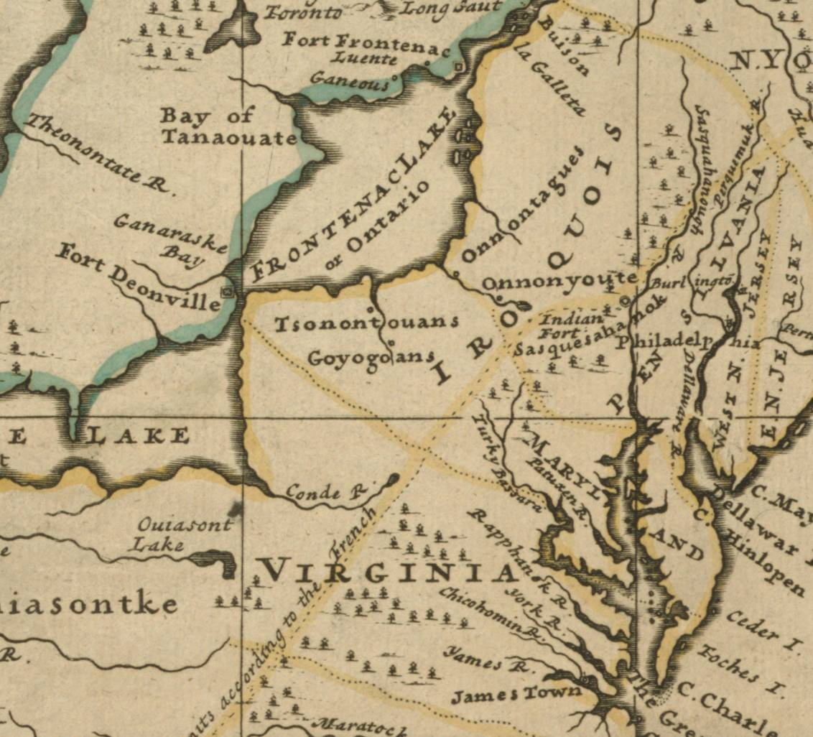
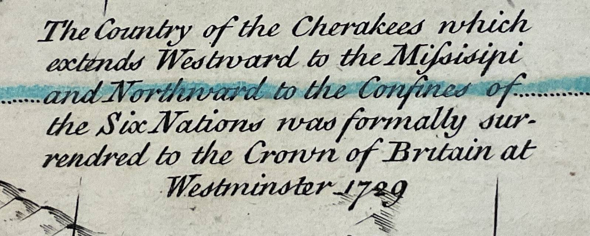
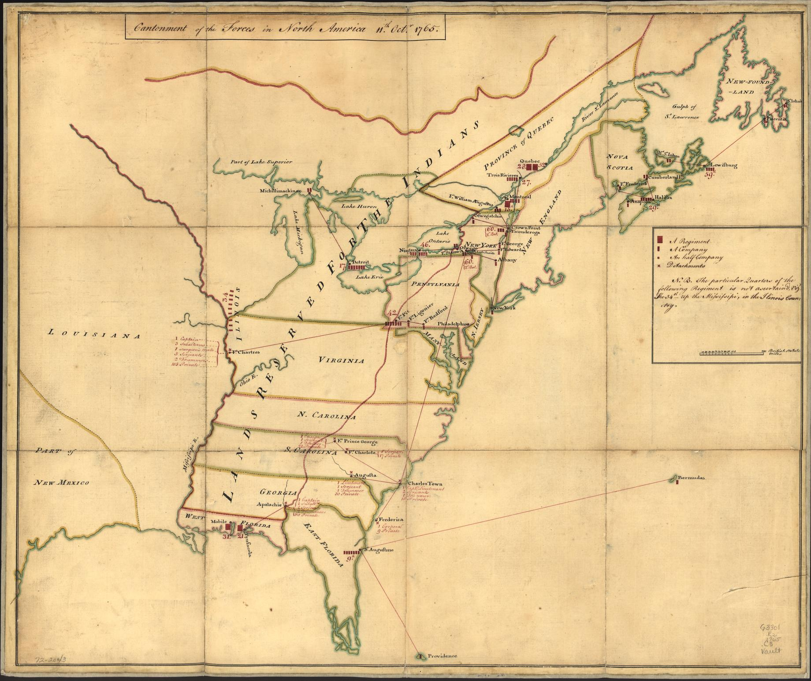
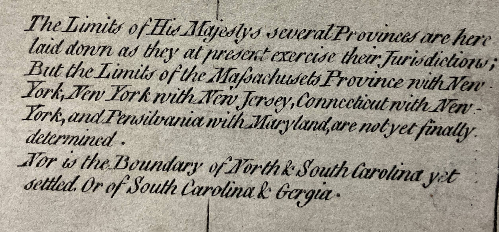

::: slide 30

The Royal Charters that created colonies out of undefined expanses of territory that were claimed on the basis of discovery included expansive and unbounded descriptions of colonial space. The second Charter of Virginia (1609) stipulated that the colony included,

_all those Lands, Countries, and Territories, situate, lying, and being in that Part of America, called Virginia, from the Point of Land, called Cape or Point Comfort, all along the Sea Coast to the Northward, two hundred miles, and from the said Point of Cape Comfort, all along the Sea Coast to the Southward, two hundred Miles, and all that Space and Circuit of Land, lying from the Sea Coast of the Precinct aforesaid, up into the Land throughout from Sea to Sea, West and Northwest;_

The ‘sea to sea’ clause was later interpreted that Virginia extended to the South Sea, an imagined body of water that colonial officials were still searching for in the 1670s. The Charter of Massachusetts Bay (1629) was similarly extensive, consisting of:

_that Parte of America, lyeing and being in Bredth, from Forty Degrees of Northerly Latitude from the Equinoctiall Lyne, to forty eight Degrees Of the saide Northerly Latitude inclusively, and in Length, of and within all the Breadth aforesaid, throughout the Maine Landes from Sea to Sea;_

:::

::: slide 31
As settlement expanded into the western reaches of Pennsylvania and Virginia, maps began to employ a wider lens, placing colonies in a Continental perspective. A number of these maps were produced by Europeans, who apparently saw North America as a space of competing empires arrayed across vast expanses of territory. The London-based German cartographer Herman Moll arranged the continent as a division of French and Indigenous territory, with tentative dotted colonial boundaries and lines to indicate disputed territorial claims. The Dutch illustrator Michael Burghers’ map of 1738 showed the ‘Principal Divisions’ of North America, including Britain’s Atlantic colonies and the massive Spanish claims in the Southwest. His colonial boundaries surge westward and terminate only when they encounter rivers or lakes. Geographical details are incorrect: the Appalachians run east-west, while the northwest is entirely empty, except for the map’s large label. The most accurate elements of the map concern the relative positions and homelands of Indigenous nations, which occupy the largest expanses of land.

:::

::: slide 32
The most detailed maps focussed on areas where the British were directly engaged in diplomacy and trade with Indigenous nations. Lewis Evans marked territorial divisions based on royal patents and charters and included blocks of text that took the form of remarks on the landscape that acknowledged what spaces had been visited and surveyed and which were still unknown. Knowledge of the interior spaces of the Northeast is based on a combination of land surveys, diplomatic travel, and the inter-cultural exchange of information.

:::

::: slide 33  
William Herbert’s ‘new’ and ‘accurate’ map of an English ‘empire’ (1755) indicated Britain’s ‘rightful claim’ to territory based on ‘Charters, and the formal surrender of their Indian friends’. Herbert was a member of the anti-Gallican society in London, a dining club for men (only) who were united in their suspicion of the global imperial policies of France. He presented French territorial claims as belligerent rather than as peaceful agricultural or urban pursuits, achieved by fortification as opposed to the ‘legal’ mechanisms of charter and treaties. The map seeks to draw the British and Indigenous worlds closer together but running in parallel tracks as suggested by two row wampum belts. English spaces are defined by dotted and coloured lines, while Indigenous spaces are presented as a broad cluster of historically occupied villages.

:::

::: slide 34  
The charter borders of colonies are shown at scale on John Mitchell’s map, where they run west to the Mississippi River. The view of the map is continental, but its principal divisions are the natural features of lakes and rivers. Where other maps showed the Appalachians in high relief, Mitchell made mountains less prominent than rivers. For a map that is apparently concerned with providing a detailed illustration of British and French dominions, Mitchell’s has surprisingly few artificial borders or boundaries. Instead, the bounds of the British domains are defined by blocks of territory ceded by Indigenous nations to the Crown.

:::

::: slide 35  
The Royal Proclamation of 1763 created the largest border in North America. In order to consolidate a vast new territory ‘secured to our Crown by the late definitive treaty of peace’, it created four new governments in lands surrendered by the French Crown at the Treaty of Paris (1763). The Proclamation established a line running from Maine to Florida and ordered that Indigenous nations should not be ‘disturbed in the possession of such parts of our dominions and territories . . . are reserved to them’. The line established by the Proclamation limited the further westward settlement of colonies and ordered that settlers on the western side of the line ‘remove themselves from such settlements’.

:::

::: slide 36  
A letter in the _St James Chronicle_ (1764) used strongly racialised language to condemn the Proclamation for having ‘given up all the Country, West of the Alleganey Mountains, to the Savages’. For settlers, the Crown’s policy gave land and sovereign recognition to the historic enemies of the colonies. Where the Crown, based on its treaties, recognised the sovereignty and territorial possession of Indigenous nations, colonial officials looked back to instances of violence that consumed dozens of colonial towns in the seventeenth century. For them, diplomacy achieved nothing, since Indigenous polities acted ‘contrary to the Faith of Treaties, subsisting between them and the Crown, invaded our Colonies East of the Alleganey Mountains, laying waste all the Country before them with Fire and Sword’.

:::

::: slide 37  
Later maps used European treaties to produce a more ‘accurate’ depiction of the British empire, placing it within a Continental view, alongside the territories of Spain – the Crown’s last European rival for imperial supremacy. Emanuel Bowen’s map of 1772 included the complete text of six of twenty-seven articles from the Treaty of Paris, including one that described all British territorial claims to the east of the Mississippi River. But while the Treaty was definitive in the sense that it established the size and limits of Britain’s vast new imperial claims, within this enlarged space the borders of colonies in relation to one another were not complete, and Bowen’s representation of tentative borders stopped far short of the Mississippi River, terminating along the Proclamation Line of 1763. This was the west.

:::

::: slide 38  
Where colonies sat near Indigenous nations, the lack of borders meant that there was no hard division between, for example, the territories of the Haudenosaunee and those of New York. Guy Johnson’s map of the Six Nations takes the Mohawk River as a natural border.: ‘The boundary of New York not being Closed this part of the country still belongs to the Mohawks’.

:::

::: slide 39
The transition between British empire and the American territorial republic was formalised by the second Treaty of Paris (1783). The United States’ new national borders were mapped in the same year by John Cary who, like Bowen, reproduced articles of the Treaty on a map with few and faint borders between states. The text of these articles did the same work as early colonial charters, in that they described – this time on a continental scale – the agreed boundaries of the United States, ‘that all disputes which might arise in future, on the subject of the boundaries of the said UNITED STATES may be prevented’. Thicker and apparently more definite state borders appeared on Abel Buell’s ‘new and accurate’ map of the United States (1784), the first produced in the new republic. Yet Buell’s map erased New York entirely while expanding his home state of Connecticut, which reached into the Northwest Territory. Buell’s states behaved exactly like their colonial ancestors, stretching their territorial claims from sea to sea.

:::

::: slide 40
The names and location of Indigenous nations appeared on all these maps. In its early years, the United States sought to carry on diplomatic relations in the manner of the British. Following the formalisation of the boundary set out in the Treaty of Paris (1783), the United States employed the Treaty of Fort Stanwix to push further west into the homelands and former village worlds of the Haudenosaunee. The Congress informed them that

_all the Tribes and Nations of Indians who live to the Southward and Westward of the line agreed on . . . must no longer look to the King beyond the water, but they must now look to the Great Council, the Congress of the United States at Philadelphia._

This meant that the United States would relate to Indigenous nations as independent sovereigns. Occupying less than a third of the Continent, and surrounded by the imperial claims of Britain and Spain, and facing an interior controlled by wide-ranging equestrian societies of the trans-Mississippian West, American politicians were fully aware of the spatial complexities that would influence the future development of the state. As Henry Knox, the Secretary of War, put in in 1791, ‘The United States have come into existence, as a nation, embarrassed with a frontier of immense extent, which is attended with all the peculiar circumstances’.
:::
