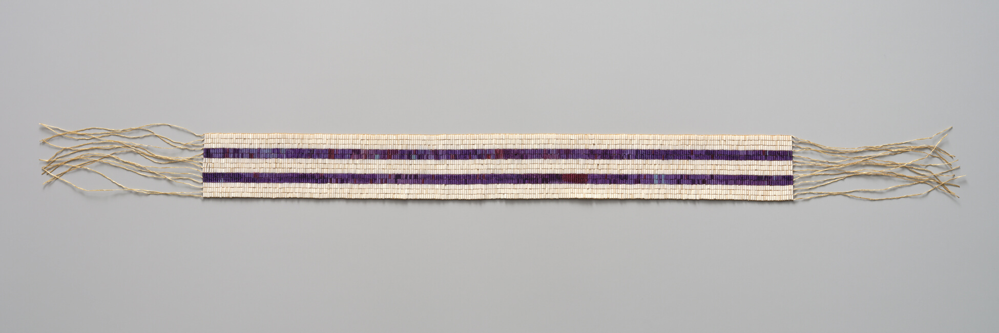
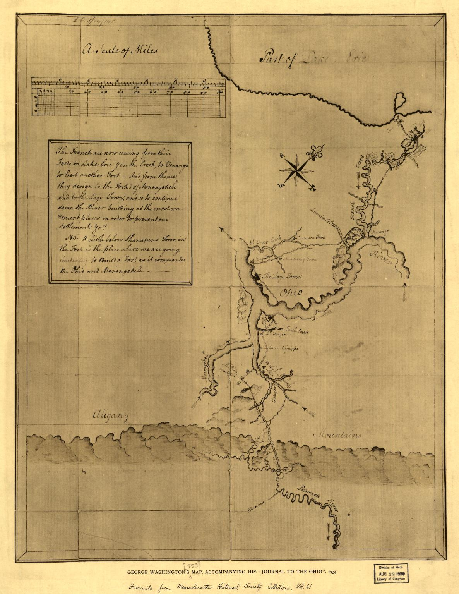
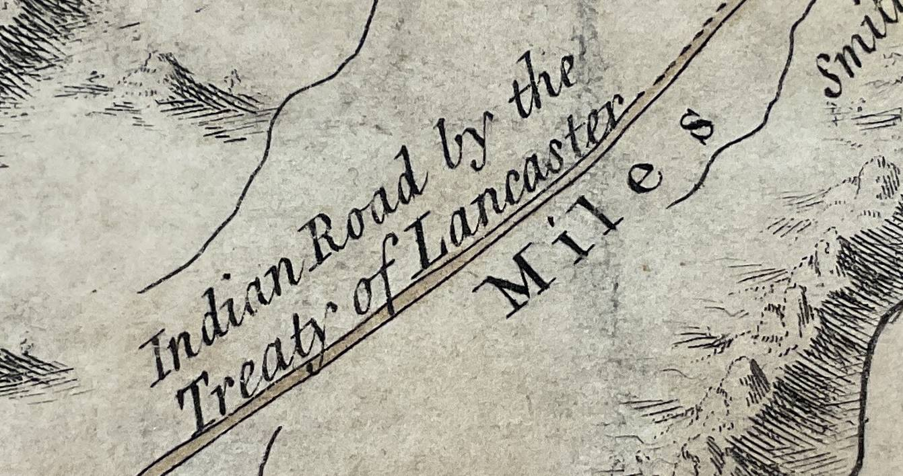

::: slide 23  
For the Haudenosaunee, the path was a powerful metaphor. It represented a connection between peoples, and defined the purposes of movement – hunting, trading, travelling to a diplomatic council or going to war. Where a diplomatic relationship was in good health, the path was described as ‘clear’ and ‘open’; and where that relationship had lapsed or been marred by conflict, the path was described as ‘grown over’, which required a diplomatic council to ‘sweep the path clean’. Paths were not interchangeable: peace and war paths were kept separate. According to the diplomat Conrad Weiser, there was ‘the usual Road that ambassadors travel’. The Haudenosaunee represented paths on wampum belts. The two-row belt (Gä•sweñta in Onondaga) used two strips of purple beads on a white ground to represent the parallel paths of the
Haudenosaunee and the European peoples who settled among them. Friendship belts connected two figures with a pathway between them, symbolising free movement and open communication. Diplomatic councils began with the greeting at the Edge of the Woods and the ritual cleansing of travellers, including the removal of briars and thorns that were picked up on paths leading to the council.
:::

::: slide 24  
Pathways were conduits of communication, which were vital to the British as they sought to win and retain Indigenous allies against the French. William Johnson, the Crown’s superintendent of Northern Affairs, operated from locations in the Mohawk Valley, and was skilled at using Haudenosaunee networks as ways of gathering, assessing and sharing vital political information. At a conference with the Mohawk in 1753, he stressed the importance of moving news along networks without altering key details:

> I must remind you of a new Custom lately introduced, very inconvenient for our mutual interest, that is, when you receive news from the Westward Southward or any other quarter, you send it from one Castle to another, till it arrives quite altered from what it was at first. I therefore require you by this Belt of Wampum to follow the old custom & send it as far as you intend it should go directly by some of your own Nation.  
> Addressing the Seneca, Johnson used the metaphor of the longhouse as an integrated pathway across long distances, and facing in several directions in order to stress the importance of swift pathways of communication:
>
> As you have aleays been looked upon as the door of the Six Nations where all news, especially from the Westward and Southward must enter and go out, we don’t hear this door open as we used to do formerly, and believe it to be worn out, & think it necessary to hang on a new one of such wood as will never decay; the noise of which when it opens should alarm all the Confederacy.
>
> 
> :::

::: slide 25  
For the geographer Lewis Evans, the Northeast was an ‘ocean of woods’. As a twenty-one-year-old officer, George Washington experienced the difficulties of movement as he carried out a mission to deliver an official dispatch to French commanders, telling them that the British Crown had exclusive right to territories in the Ohio country. Washington understood that travel required Indigenous permission and assistance. Along the way, he dispatched gifts, a ‘String of Wampum, and a Twist of Tobacco’ ahead by runner to the Six Nations. To find his route, he consulted Tanaghrisson, a Catawba adopted by the Seneca who served as an emissary between the Haudenosaunee and the nations of the Ohio. Washington ‘desire’d him to relate some of the Particulars of his Journey to the French Commandant, and Reception there; and to give me an Account of the Ways and Distance’. He received an account of speeches between the French and the Delaware nation of the Ohio, words that were represented on a ‘very large String of black and white Wampum, which was to be sent up immediately to the Six Nations’.
:::

::: slide 26  
Washington found himself serving as a messenger between the Ohio nations and the Haudenosaunee, carrying wampum, news, and gifts in addition to his original dispatch. His party struggled to make progress toward the French positions, having chosen to set out at the end of October.

> At 11 o’Clock we set out for the Fort, and were prevented from arriving there ‘til the 11th by excessive Rains, Snows, and bad Travelling, through many Mires and Swamps, which were obliged to pass, to avoid crossing the Creek, which was impossible, either by fording or rafting, the Water was so high and rapid.

Finding open water, Washington decided to try travel by canoe:

> We had a tedious and very fatiguing Passage down the Creek, several Times we had like to have been staved against Rocks, and many Times were obliged all Hands to get out and remain in the Water Half an Hour or more, getting over the Shoals; at one Place the Ice had lodged and made it impassable by Water; therefore we were obliged to carry our Canoe across a Neck of Land.

Washington eventually abandoned his bulky British uniform, and ‘put myself in an Indian walking Dress’. Transposed onto John Mitchell’s map, Washington’s journey could be measured in inches. In this short distance, he was never in ‘British’ or French territory, but instead moved through unseen diplomatic and kinship pathways that carried wampum, information and gifts of tribute along multiple pathways.

:::

::: slide 27  
As Washington learned, rivers were the highways of early America. Contemporary maps, such as the one based on Joshua Fry and Peter Jefferson’s detailed survey of Virginia, emphasised rivers as conduits of communication and movement. This was a matter of imperial policy. According to a memo prepared for George III, ‘no Communication can be depended on in that Country which is not by Rivers or Lakes where we can command the Navigation’. Just as prominent were ranges of the Northeast Appalachians that formed a natural barrier to the west. 
:::

::: slide 28  
Europeans found their way along single file Indigenous pathways. Movement, rather than rootedness in one location, was a key expression of power. The Northeast was animated and alive with multiple forms of connection, from kinscapes, trade paths, war paths (or ‘force roads’) and traditional routes to council fires and key locales in the diplomatic landscape. The difficulty of travelling over distance meant that riverine and maritime systems were the principal conduits of connection, and contemporary maps give prominence to these. At the same time, the assumptions that underpinned a world conceived as paths clashed with concepts of borders as hard boundaries that could not be crossed at will.

:::
